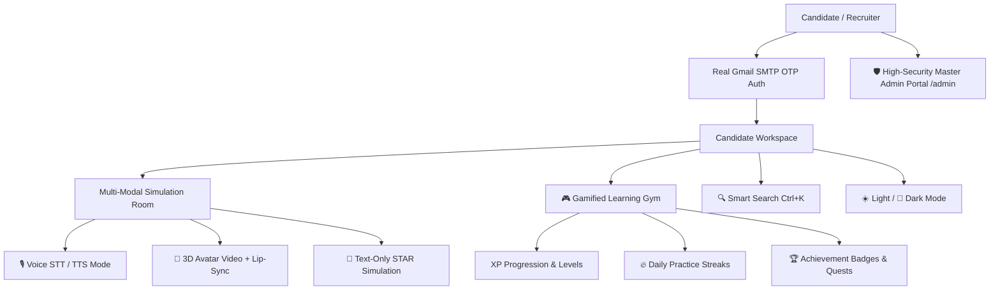

# IntervAI 🚀
### AI-Powered Real-Time Interview Coach & Simulation Platform

> **Author & Lead Architect:** Gautam Kumar Maurya ([@gkm563](https://github.com/gkm563)) • **United Institute of Technology (UIT)**  
> **Repository:** [https://github.com/gkm563/IntervAI.git](https://github.com/gkm563/IntervAI.git)  
> **Target:** High-performance, multi-modal AI interview simulation platform optimized for campus placements and global engineering roles.

---

## 📖 Overview

**IntervAI** is an advanced AI interview coach and simulation platform created by **Gautam Kumar Maurya (`gkm563`)** from **United Institute of Technology (`UIT`)**. Unlike static question banks, IntervAI parses candidate resume projects, calibrates questions against target job roles and companies, and simulates realistic interview turns across **Voice Mode**, **3D Avatar Video Mode**, and **Text Simulation** with deep multi-rubric feedback on technical depth, STAR structure, and communication.

---

## 🌟 Major Platform Capabilities



### 1. 🎙️ Multi-Modal Interview Room
- **Voice Mode**: Real-time continuous Speech-to-Text (STT) transcription and natural Speech-Synthesis (TTS) AI voice playback.
- **3D Avatar Video Mode**: 60 FPS Canvas procedural 3D interviewer mesh with viseme phoneme mouth synchronization, gazing, and candidate webcam mirror stream.
- **Text Mode**: Rapid, low-bandwidth chat simulation with instant multi-rubric scoring (Relevance, Technical Depth, Clarity, and STAR structuring).

### 2. 🎮 Gamified Learning & Progression Gym
- **XP Progression & Tiers**: 5 candidate levels (*Code Cadet* ➡️ *Algorithm Apprentice* ➡️ *Architecture Ace* ➡️ *Staff Strategist* ➡️ *Principal Prodigy*).
- **Daily Practice Streaks**: 🔥 Multi-day streak flame tracker in the navigation bar.
- **Achievement Badges & Quests**: Interactive Trophy Showcase modal with claimable XP rewards for daily warmup drills and STAR challenges.
- **Celebratory Toasts**: Floating gold XP banner bursts upon completing mock turns.

### 3. 🔍 Global Smart Search & Command Palette (`Ctrl + K`)
- Instant fuzzy search across question drills, interview modalities, navigation routes, appearance settings, and platform actions with full keyboard navigation (`↑`/`↓`/`Enter`/`Esc`).

### 4. ☀️ Light Mode & 🌙 Dark Navy Mode
- Seamless theme toggle between **Dark Navy Mode** (`#070F22`) and **Crisp Light Mode** (`#F8FAFC`), persisted in `localStorage`.

### 5. 🛡️ High-Security Master Admin Portal (`/admin`)
- **Level 5 Root Clearance**: Master Super Admin pre-authorized for `maurgk212104@gmail.com` (Gautam Kumar Maurya).
- **Role-Based Access Control (RBAC)**: Backend `requireAdmin` token guards and frontend `AdminRoute` security shields.
- **System Telemetry**: Real-time host CPU, RAM, PostgreSQL pool, and Gmail SMTP 465 connection health.
- **Candidate Moderation**: Searchable directory with user activation/suspension and admin role promotions.
- **Broadcast Alert Dispatcher**: Push high-priority announcements directly to candidate inboxes.
- **Question Bank Manager**: Curate, categorize, and calibrate mock interview questions.

### 6. 🌐 Comprehensive SEO & Structured Data
- Schema.org multi-entity JSON-LD graph indexing **Gautam Kumar Maurya (gkm563)** and **United Institute of Technology (UIT)**, with dynamic `robots.txt` and `sitemap.xml`.

---

## 🏗️ Repository Structure

```text
intervai/
├── frontend/                  # React 18 + Vite + TypeScript + Tailwind CSS
│   ├── src/
│   │   ├── components/
│   │   │   ├── interview/     # 3D AvatarCanvas, VoiceEngine STT/TTS, WebcamPreview, ActiveInterviewRoom
│   │   │   ├── gamification/  # GamificationModal & Quests
│   │   │   ├── search/        # GlobalSearchModal (Ctrl+K)
│   │   │   └── layout/        # DashboardLayout, Navbar, Footer
│   │   ├── context/           # AuthContext, ThemeContext, GamificationContext
│   │   └── pages/
│   │       ├── auth/          # Register, Login, VerifyEmail (Gmail OTP), ResetPassword
│   │       ├── dashboard/     # Overview, Resume, Interviews, Reports, Practice, Progress, Schedule, Settings
│   │       └── admin/         # AdminLayout, AdminOverview, AdminUsers, AdminSecurity, AdminBroadcast, AdminQuestions
├── backend/                   # Node.js + Express + TypeScript + PostgreSQL
│   ├── src/
│   │   ├── admin/             # Admin Controller, Middleware, Routes, Audit Service
│   │   ├── auth/              # JWT, Argon2, Refresh Tokens, Email OTP
│   │   ├── email/             # Nodemailer Gmail SMTP Relay (maurgk212104@gmail.com)
│   │   ├── notifications/     # Notification Service & API
│   │   └── database/          # PostgreSQL Client & Migrations
├── infrastructure/            # Docker, Nginx Reverse Proxy, and Postgres migrations
├── docker-compose.yml         # One-command full stack orchestration
└── README.md
```

---

## 🚀 Running Locally

### 1. Start Backend & Database
```bash
cd backend
npm install
npm run dev
```
Backend API will start on **`http://localhost:4000`** with live Gmail SMTP delivery.

### 2. Start Frontend Web Client
```bash
cd frontend
npm install
npm run dev
```
Frontend Client will open on **`http://localhost:5173`**.

---

## 👨‍💻 Author & Institutional Credit

- **Architect & Developer:** Gautam Kumar Maurya ([@gkm563](https://github.com/gkm563))
- **Email:** `maurgk212104@gmail.com`
- **Institution:** United Institute of Technology (UIT)
- **Repository:** [https://github.com/gkm563/IntervAI.git](https://github.com/gkm563/IntervAI.git)
